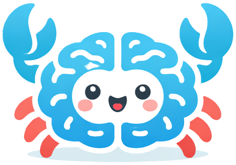

<p align="center">
  
</p>

<h1 align="center">brainclaw</h1>

<p align="center"><strong>Local-first coordination for humans and coding agents.</strong></p>

<p align="center">
  <a href="https://github.com/jberdah/brainclaw/actions/workflows/ci.yml"></a>
</p>

---

brainclaw gives a workspace a shared coordination layer: project memory, explicit plans, file claims, handoffs, layered instructions, and prompt-ready context — stored locally, versioned in Git, readable in plain text.

It sits alongside Copilot, Claude Code, Cursor, Codex, Windsurf, OpenCode, Antigravity/Gemini CLI and any other coding agent. It does not replace them. It helps them work together.

---

## Why brainclaw exists

Coding agents are getting better at local code generation, but they still struggle with shared project state.
Across real projects, agents often miss active constraints, forget known traps, duplicate work, step on the same files, and lose context between sessions.

brainclaw solves this by giving the workspace a shared coordination layer that both humans and agents can read and update.

---

## What it provides

| | |
|---|---|
| **Project memory** | constraints, decisions, traps, handoffs, layered instructions |
| **Coordination state** | shared plans, file claims, handoffs, runtime notes, board views |
| **Agent-ready context** | compact, prompt-sized context generated from real workspace state |
| **Native agent files** | auto-writes `CLAUDE.md`, `AGENTS.md`, `GEMINI.md`, `.cursor/rules/`, `.windsurfrules`, etc. |
| **Local-first storage** | plain text + JSON, Git-friendly, no cloud, no telemetry |

---

## Works With

brainclaw is designed to sit alongside the coding agents teams are already using.

| Logo | Agent | Brainclaw fit | Best use today |
|---|---|---|---|
|  | **Claude Code** | Best fit | full workflow integration with instructions, MCP, commands, and session hooks |
|  | **Codex** | Strong fit | structured CLI/MCP collaboration with explicit plans, claims, and handoffs |
|  | **Cursor** | Strong fit | repo-native coordination with rules + MCP |
|  | **OpenCode** | Strong fit | simple local-first setup with `AGENTS.md` + workspace MCP |
|  | **Windsurf** | Good fit | guided workflows with instructions, hooks, and MCP |
|  | **Roo** | Good fit | workspace coordination with rules + MCP |
|  | **Continue** | Good fit | context access and MCP-driven collaboration in editor workflows |
|  | **Antigravity / Gemini CLI** | Promising fit | CLI-first workflows with `GEMINI.md` + MCP |
|  | **Cline** | Functional fit | lightweight Brainclaw usage through rules + MCP |
|  | **GitHub Copilot** | Supported fit | project awareness and shared instructions, with lighter workflow control |

brainclaw is most effective today when one agent works at a time in a given checkout and the next agent resumes from shared context, claims, and handoffs.

---

## Quick example

```bash
npx brainclaw setup --yes
npx brainclaw init

npx brainclaw memory create decision "OAuth migration now goes through auth-gateway" --tag auth
npx brainclaw memory create constraint "Payments module frozen until 2026-04-01" --tag payments
npx brainclaw memory create trap "Checkout E2E tests are flaky on Windows" --severity high
npx brainclaw plan create "Coordinate auth rollout" --priority high
npx brainclaw memory create handoff "Validate refund endpoint" --from backend --to qa

npx brainclaw context --json
npx brainclaw status
```

---

## Installation

```bash
npm install -g brainclaw   # global
# or
npm install && npm run build  # from source
```

Also available as `bclaw`:

```bash
bclaw init
bclaw status
```

---

## Quickstart

```bash
brainclaw setup --yes
brainclaw init
brainclaw memory create decision "OAuth migration now goes through auth-gateway" --tag auth
brainclaw memory create constraint "Payments module frozen until 2026-04-01" --tag payments
brainclaw memory create trap "Checkout E2E tests are flaky on Windows" --severity high
brainclaw plan create "Coordinate auth rollout" --priority high
brainclaw context --json
```

→ [Full quickstart guide](https://github.com/jberdah/brainclaw/blob/master/docs/quickstart.md)

---

## Current Limitation

For now, avoid having multiple coding agents edit the same project in parallel.

brainclaw already helps one agent resume or review another agent's work with better shared context, plans, claims, and handoffs. But until dedicated Git worktrees per agent/session are implemented, concurrent edits in the same checkout can still create conflicts, overwritten local state, or confusing Git transitions.

Recommended use today:

1. let one agent work at a time in a given checkout
2. use handoffs when switching from one agent to another
3. use shared plans, claims, and context to preserve continuity

---

## How it fits into agent workflows

brainclaw sits *alongside* Copilot, Claude Code, Cursor, Codex, Windsurf, Cline, Roo, Continue, OpenCode, and Antigravity/Gemini CLI.

Typical flow:

1. `brainclaw setup` — machine-level bootstrap for agent integrations and global prerequisites
2. `brainclaw init` — seeds workspace memory, writes to the detected agent's native instruction file
3. record canonical memory with `brainclaw memory create ...` and work items with `brainclaw plan create ...`
4. let agents read brainclaw context before editing
5. use claims to reduce collisions
6. hand work off explicitly when needed
7. keep shared state visible across sessions

brainclaw can also expose collaboration views through MCP-readable tools, including context, board views, and structured lists for plans, claims, agents, instructions, and candidates.

---

## Documentation

| | |
|---|---|
| [docs/quickstart.md](https://github.com/jberdah/brainclaw/blob/master/docs/quickstart.md) | Get started in 5 minutes |
| [docs/cli.md](https://github.com/jberdah/brainclaw/blob/master/docs/cli.md) | Full command reference |
| [docs/concepts/memory.md](https://github.com/jberdah/brainclaw/blob/master/docs/concepts/memory.md) | What "memory" means in brainclaw |
| [docs/concepts/plans-and-claims.md](https://github.com/jberdah/brainclaw/blob/master/docs/concepts/plans-and-claims.md) | Coordination layer |
| [docs/concepts/runtime-notes.md](https://github.com/jberdah/brainclaw/blob/master/docs/concepts/runtime-notes.md) | Ephemeral observations |
| [docs/integrations/overview.md](https://github.com/jberdah/brainclaw/blob/master/docs/integrations/overview.md) | How to integrate with any agent |
| [docs/integrations/cursor.md](https://github.com/jberdah/brainclaw/blob/master/docs/integrations/cursor.md) | Cursor |
| [docs/integrations/claude-code.md](https://github.com/jberdah/brainclaw/blob/master/docs/integrations/claude-code.md) | Claude Code |
| [docs/integrations/copilot.md](https://github.com/jberdah/brainclaw/blob/master/docs/integrations/copilot.md) | GitHub Copilot |
| [docs/integrations/codex.md](https://github.com/jberdah/brainclaw/blob/master/docs/integrations/codex.md) | Codex |
| [docs/integrations/mcp.md](https://github.com/jberdah/brainclaw/blob/master/docs/integrations/mcp.md) | MCP tools |
| [docs/storage.md](https://github.com/jberdah/brainclaw/blob/master/docs/storage.md) | Storage model |
| [docs/security.md](https://github.com/jberdah/brainclaw/blob/master/docs/security.md) | Security model |
| [docs/review.md](https://github.com/jberdah/brainclaw/blob/master/docs/review.md) | Reflective review |
| [docs/reputation.md](https://github.com/jberdah/brainclaw/blob/master/docs/reputation.md) | Reputation signals |

---

## Running tests

```bash
npm test                   # unit + smoke (fast path)
npm run test:e2e           # full suite
npm run test:coverage      # with coverage report
```

---

## Changelog

### v0.9.10

- **OpenCode** : détection et auto-config MCP workspace via `opencode.json`; l'export réutilise `AGENTS.md`
- **Antigravity / Gemini CLI** : détection et export `gemini-md` vers `GEMINI.md`, avec MCP machine-level sous `.gemini/antigravity/mcp_config.json`
- **Workflow export** : la doc export couvre désormais explicitement les nouveaux formats et fichiers générés

### v0.7.2

- **UserPromptSubmit hook** : correction du format — `brainclaw context` (texte markdown) au lieu de `--json` pour injection correcte dans le contexte Claude Code

### v0.7.1

- **Cross-platform `npx` fix** : `brainclaw init` et `brainclaw export` ajoutent désormais brainclaw en `devDependency` du projet cible — `npx brainclaw` fonctionne dans les hooks Claude Code sans dépendre du PATH global (résout Windows WSL/Git Bash)

### v0.7.0

- **Claude Code** : intégration native complète — MCP (`.mcp.json`), slash command (`.claude/commands/brainclaw.md`), hooks de session (`UserPromptSubmit` + `Stop`) dans `.claude/settings.local.json`
- **Cursor** : config MCP machine-level (`~/.cursor/mcp.json`) ajoutée à l'auto-config
- **Roo Code** : config MCP workspace (`.roo/mcp.json`)
- **Continue** : config MCP workspace (`.continue/config.json`, format array)
- **Hygiene section** renforcée : workflow plan/claim/session-end inclus dans toutes les instructions générées
- **Canal de mise à jour local** (`brainclaw version --publish-local`) : tarball + manifeste `.releases/`

---

## License

[Business Source License 1.1](LICENSE) — © 2024-2026 Juan Berdah

Free for non-production and internal use. Production use is permitted provided you do not build or offer a competing product or service (shared agent memory / coordination / context management for coding agents or development teams). Each version converts to MIT four years after its release date.

For commercial licensing inquiries, contact the licensor.
